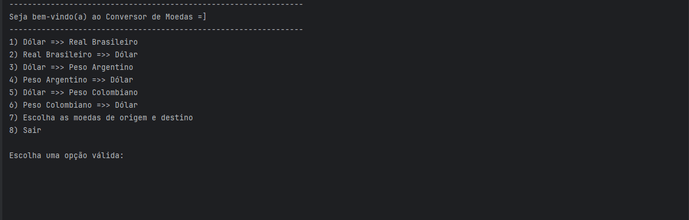

<h1 align="center" style="font-weight: bold;">Conversor de Moedas 💻</h1>

<p align="center">
 <a href="#tech">Tecnologias</a> • 
 <a href="#started">Começando</a> • 
 <a href="#routes">API Endpoints</a>
</p>

<p align="center">
    <b>Projeto desenvolvido no programa ONE - Oracle Next Education realizado pela Alura em parceria com a Oracle. O projeto foi desenvolvido em Java 17 no decorrer da especialização em back-end. Este projeto é um conversor de moedas que utiliza uma webAPI para obter taxas de conversão atualizadas.</b>
</p>

<p align="center">
    
</p>

<h2 id="tech">💻 Tecnologias</h2>

- Java
- Gson

<h2 id="started">🚀 Começando</h2>

<h3>Pré-requisitos</h3>

Será necessário inserir manualmente a biblioteca:

- [Gson](https://mvnrepository.com/artifact/com.google.code.gson/gson/2.11.0)

<h2 id="routes">📍 API Endpoints</h2>

| route               | description                                          
|----------------------|-----------------------------------------------------
| <kbd>GET [/authenticate](https://v6.exchangerate-api.com/v6/658681d7a1207d736a141708/latest/USD)</kbd>     | Retornará as taxas de câmbio da moeda de origem para todas as outras moedas)

<h3>GET</h3>

**RESPONSE**
```json
{
	"result": "success",
	"documentation": "https://www.exchangerate-api.com/docs",
	"terms_of_use": "https://www.exchangerate-api.com/terms",
	"time_last_update_unix": 1585267200,
	"time_last_update_utc": "Fri, 27 Mar 2020 00:00:00 +0000",
	"time_next_update_unix": 1585353700,
	"time_next_update_utc": "Sat, 28 Mar 2020 00:00:00 +0000",
	"base_code": "USD",
	"conversion_rates": {
		"USD": 1,
		"AUD": 1.4817,
		"BGN": 1.7741,
		"CAD": 1.3168,
		"CHF": 0.9774,
		"CNY": 6.9454,
		"EGP": 15.7361,
		"EUR": 0.9013,
		"GBP": 0.7679,
		"...": 7.8536,
		"...": 1.3127,
		"...": 7.4722, etc. etc.
	}
}
```
<p align="center">
    
</p>
